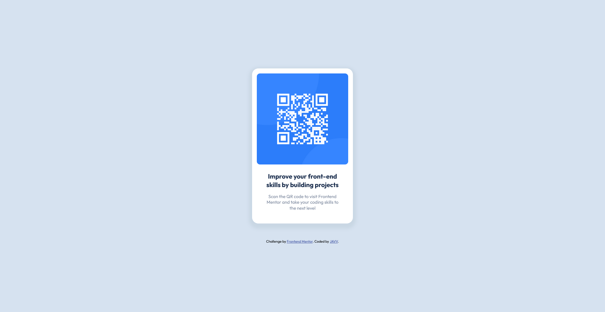

# QR Code Component - Frontend Mentor

Hello guys, Welcome to my repository! This is my solution to the [QR code component challenge on Frontend Mentor](https://www.frontendmentor.io/challenges/qr-code-component-iux_sIO_H).

## Table of contents

- [Overview](#overview)
  - [Screenshot](#screenshot)
  - [Links](#links)
- [My process](#my-process)
  - [Built with](#built-with)
  - [What I learned](#what-i-learned)
  - [Continued development](#continued-development)
- [Author](#author)

## Overview

### Screenshot




### Links

- Solution URL: [Github](https://github.com/daisukeeita/QR-Code-Component)
- Live Site URL: [QR-Code-Component Website](https://daisukeeita.github.io/QR-Code-Component/)

## My process

### Built with
- Semantic HTML5 markup
- CSS custom properties
- Flexbox

### What I learned

What I learned here is how to use the custom properties of the CSS, also the naming convention technique. Though as of now, I'm on the level where I'm still applying the theoretical knowledge behind the BEM technique.

```css
:root {
  --neutral-color-0:   #ffffff;
  --neutral-color-100: #d6e2f0;
  --neutral-color-200: #c9d7e4;

  --font-color-onPrimary-500: #7b879d;
  --font-color-onPrimary-800: #1f3251;

  --font-family-outfit: "Outfit", sans-serif;

  --font-size-300: 0.889rem;
  --font-size-400: 1rem;
  --font-size-500: 1.125rem;
  --font-size-600: 1.266rem;

  --font-weight-regular: 400;
  --font-weight-bold:    700;
}
```

```css
.qr-container__image {
  width:         290px;
  height:        290px;
  margin-bottom: 25px;
  border-radius: 10px;
}
```

### Continued development

By seeing how I approached the challenge, my focus is to enhance to application of the naming convention techniques and the naming of the custom properties of the css. How I see it is it can improve the reusability of the css and its readability. 

## Author

- Frontend Mentor - [@daisukeeita](https://www.frontendmentor.io/profile/daisukeeita)